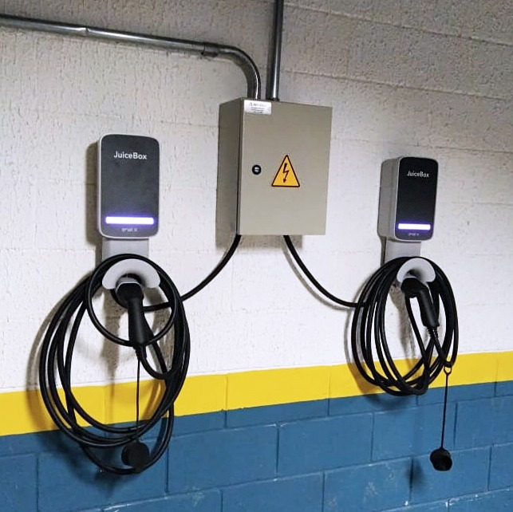

# ⚡ Instalação de Carregador Veicular

---

## 🔋 Solução de Mobilidade Elétrica

Implementação de infraestrutura elétrica para carregamento veicular, alinhada às demandas modernas de mobilidade elétrica, eficiência energética e sustentabilidade.

---

## 📌 Problema

Necessidade de instalação de ponto de recarga para veículo elétrico, garantindo segurança e compatibilidade com o sistema elétrico existente.

---

## ⚠️ Desafio técnico

- Dimensionamento correto da carga elétrica  
- Verificação da capacidade do sistema  
- Proteção adequada do circuito  
- Integração com o quadro elétrico existente  

---

## 🛠️ Solução aplicada

Execução da infraestrutura elétrica para carregamento veicular, incluindo:

- Instalação de circuito dedicado  
- Dimensionamento de cabos e proteções  
- Adequação do sistema elétrico  
- Instalação do ponto de recarga  

---

## ✅ Resultado

✔ Sistema seguro e confiável  
✔ Carregamento eficiente  
✔ Proteção da instalação elétrica  
✔ Preparação para futuras expansões  

---

## 💡 Observação técnica

A instalação de carregadores veiculares exige atenção ao dimensionamento da carga e à proteção do sistema, garantindo segurança, eficiência e conformidade com normas técnicas.
