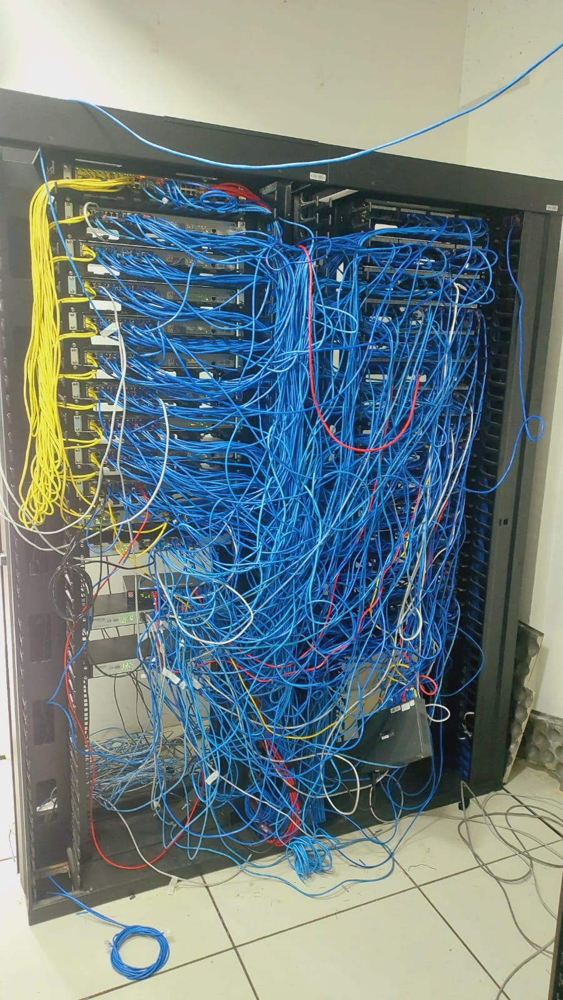
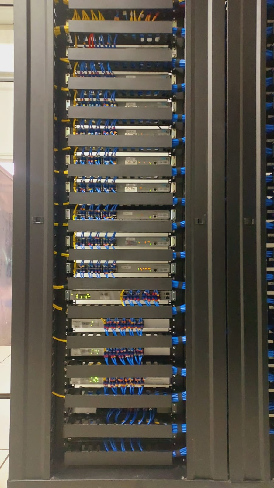

# 🖥 Organização de CPD

---

## 📌 Problema

Ambiente desorganizado dificultando manutenção, identificação de cabos e operação segura.

---

## ⚠️ Desafio técnico

- Organização de cabeamento  
- Identificação correta dos circuitos  
- Padronização do ambiente  

---

## 🔧 Solução aplicada

Reorganização completa do CPD com identificação de cabos, padronização e melhoria na estrutura do sistema.

---

## 📈 Resultado

✔ Facilidade de manutenção  
✔ Redução de erros operacionais  
✔ Ambiente organizado e seguro  

---

## 🧠 Observação técnica

A organização e padronização são essenciais para garantir confiabilidade e eficiência na operação de sistemas.

## 📸 Execução

### Antes

### Depois

