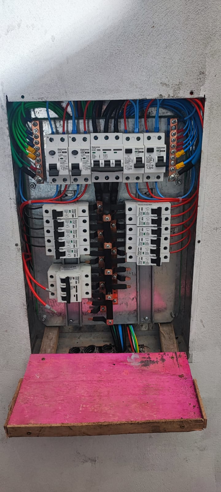

# 🔧 QGBT com Proteção Individual por Circuito

---

## 📌 Problema

Quadro geral com proteção compartilhada, gerando risco de desligamento total em caso de falha.

---

## ⚠️ Desafio técnico

- Garantir seletividade elétrica  
- Reduzir impacto de falhas  
- Manter operação segura  

---

## 🔧 Solução aplicada

Foi realizada a reestruturação do QGBT com implementação de proteção individual por circuito, permitindo maior controle e isolamento de falhas.

---

## 📈 Resultado

✔ Redução de falhas generalizadas  
✔ Aumento da confiabilidade do sistema  
✔ Maior segurança operacional  

---

## 🧠 Observação técnica

A individualização das proteções permite maior seletividade, evitando desligamentos desnecessários e melhorando a estabilidade do sistema elétrico.
